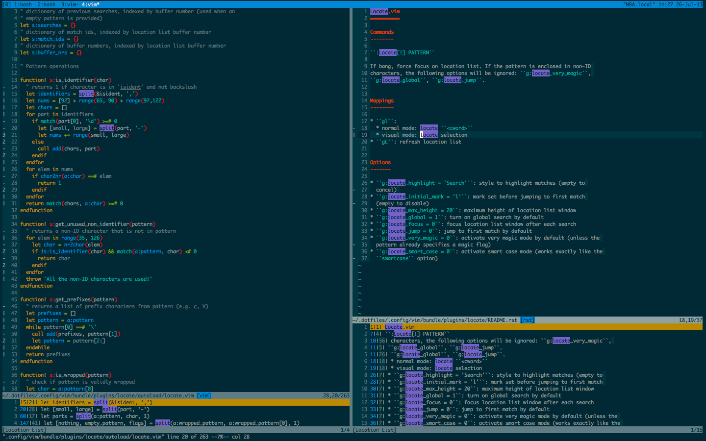

.. default-role:: code

Locate.vim
==========

`/` and `?` are search *motions*: simple and powerful. But when searching for a 
common pattern, especially in a large file, it can be hard to get to the one 
match you're looking for (tired of hitting `n`?). They also don't provide an 
overview of where the matches are: the only way to figure it out is to move the 
cursor.

Vim comes with alternate commands for this use-case (see `:help vimgrep` or 
`:help ilist`), but they all require manual work (refreshing the list of 
results, no highlighting, etc.). `:Locate`, or `:L` for short, handles all this 
and more.

Features
--------

* Window specific highlighting!
* Automatic sizing, sorting and refreshing of results.
* Quick search for current selection / word under cursor.
* Customizable smartcase_ and `very magic`_ modes.

Quickstart
----------

+ `:L foobar` searches for "foobar" inside the current window (short for 
  `:Locate foobar`). Matches in the current window will be highlighted.
+ `gl` searches for the word under the cursor (normal mode) or the current 
  selection (visual mode).
+ `:Lpurge` closes the results list and cancels highlighting (can also be done 
  via `:lclose`).

After each new search the cursor will jump to the location list and remember 
its position inside the searched window (this can be configured with the 
`g:locate_focus` and `g:locate_jump_to` options respectively). The list of 
results will stay updated on save. There are more commands and configuration 
options which you can read about by running `:help Locate`.

Installation
------------

With `pathogen.vim`_:

.. code:: bash

  $ cd ~/.vim/bundle
  $ git clone https://github.com/mtth/locate.vim

Otherwise simply copy the folders into your `.vim` directory.

.. _smartcase: http://vimdoc.sourceforge.net/htmldoc/options.html#'smartcase'
.. _`very magic`: http://vimdoc.sourceforge.net/htmldoc/pattern.html#/magic
.. _`pathogen.vim`: https://github.com/tpope/vim-pathogen
